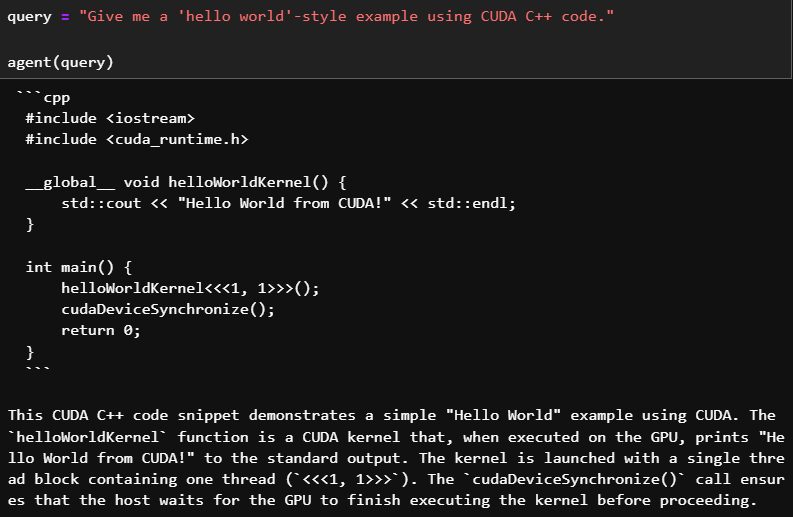
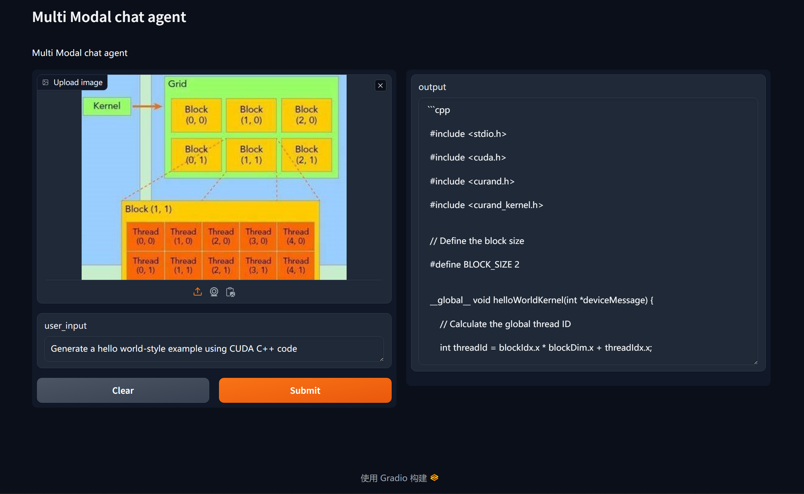
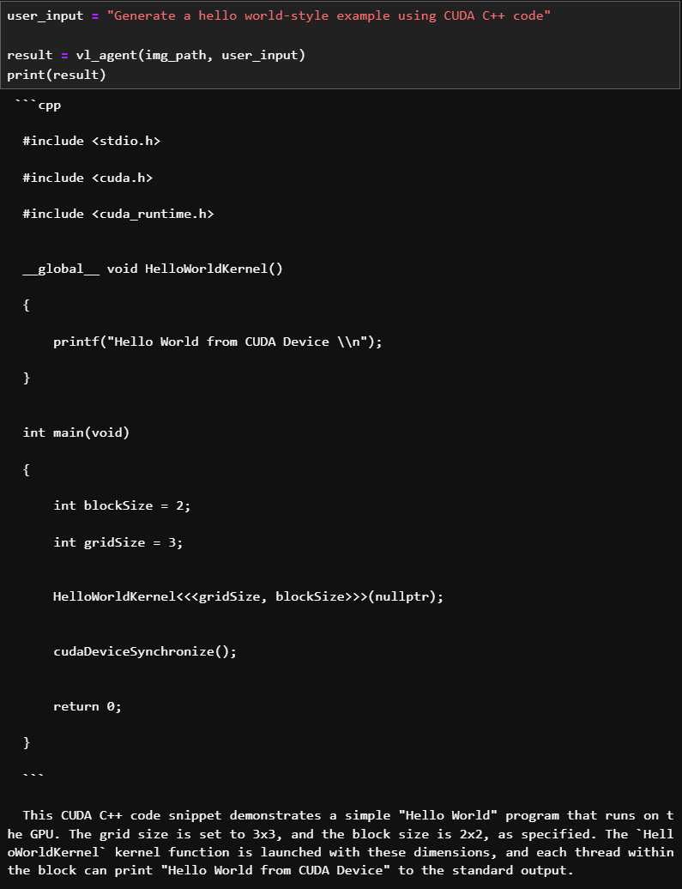

# RAG&Vision Enhanced CUDA Coding Agent

## Project description
1. Construct two CUDA coding agents, which are RAG-enhanced and Vision enhanced named RAG-Agent and VL-Agent, respectively.
2. The RAG-Agent utilizes RAG enhancement technology to vectorize and store NVIDIA CUDA Programming Guide as an external document. Ability to search for answers related to questions in official documents and write CUDA code according to user needs.  

   ❤  By first consulting official documents and then answering programming questions, the accuracy and authority of the answers have been improved.
3. The VL-Agent leverages multimodal large model technology to parse images inputted for analysis, and based on the image content, it writes CUDA code that meets the requirements.
   
   ❤ Focusing on the pain point where users are unclear and lack intuition when programming CUDA regarding the Grid and Block size, the model's visual capabilities assist users in solving the "last mile" problem from "having a mental picture" to "writing the code."

## Methodology
The project use the NVIDIA NIM platform to build the agent.
### Model selection
🤖RAG-Agent：
1. Chat Model：`microsoft/phi-3-small-128k-instruct`
2. Embed Model：`NV-Embed-QA`

🤖VL-Agent:
1. Vision Model： `microsoft/phi-3-vision-128k-instruct`
2. Chat Model：`microsoft/phi-3-small-128k-instruct`

## Presentation
### 🤖RAG-Agent

### 🤖VL-Agent

